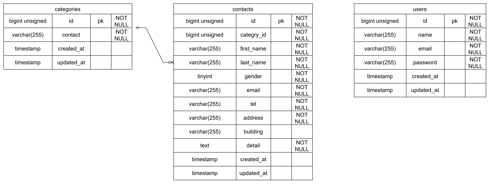

環境構築

Dockerビルド
・git@github.com:snc78tk-hash/test_contact-form.git
・docker compose -d --build

Laravel環境
・docker compose exec php bash
・composer install
・cp .env.example
・php artisan key:generate
・php artisan migrate
・php artisan db.seed

開発環境
・お問い合わせ画面 : http://local
・ユーザー登録 : http://local/register
・phpMyadmin : http://localhost:8080

使用技術
.php 8.2.11
.laravel 8.8.3.8
.Mysql 8.0.26
.nginx 1.21.1

er図

